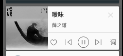
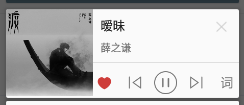
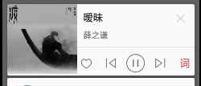
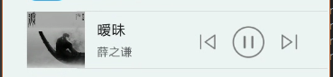

### 通知栏集成说明

通知栏集成比较麻烦一点，如果你想使用集成好的通知栏，需要在初始化的时候这样做：

```java
if (!BaseUtil.getCurProcessName(this).contains(":musicLibrary")) {
    NotificationCreater creater = new NotificationCreater.Builder()
            .setTargetClass("com.lzx.nicemusic.module.main.HomeActivity")
            .build();
    MusicManager.get()
            .setContext(this)
            .setNotificationCreater(creater)
            .init();
}
```

只有要添加 setNotificationCreater()，即可集成通知栏功能了(当然还有一些命名约定要做，下面会说到)。

NotificationCreater 是一个配置通知栏一些属性的类，里面有一些属性：
```java
public class NotificationCreater implements Parcelable {
    private String targetClass;
    private String contentTitle;
    private String contentText;
    private PendingIntent startOrPauseIntent;
    private PendingIntent nextIntent;
    private PendingIntent preIntent;
    private PendingIntent closeIntent;
    private PendingIntent favoriteIntent;
    private PendingIntent lyricsIntent;
    private PendingIntent playIntent;
    private PendingIntent pauseIntent;
    private PendingIntent stopIntent;
    private PendingIntent downloadIntent;
    ...
}
```
1. targetClass 一定要设置，他是你点击通知栏后转跳的界面，填的是完整路径。
2. contentTitle 和 contentText 对应着 Notification 的 contentTitle 和 contentText，如果不设置，默认值为歌曲的歌名和艺术家名。
3. 后面的 PendingIntent 是通知栏里面一些按钮的点击处理 PendingIntent，lib 里面实现了 startOrPauseIntent，closeIntent，nextIntent 和 preIntent。其他需要自己 set 进去。具体用法下面会说到。

#### 一些约定

不同手机的通知栏背景有的是白色背景，有的是黑色或者半透明的背景，所以需要两套的布局，分别对应着两种背景。lib 会自动判断背景颜色来选择布局。      
自定义通知栏有两种 RemoteView ，一个是普通的 ContentView（下面称为`普通通知栏`），一个是 BigContentView（下面称为`大通知栏`） ,所以也需要两种布局。  
所以加起来通知栏的布局有四个。 如下图所示：  
白色背景大小布局通知栏:  
<a href="art/light2.png"></a>
<a href="art/light3.png"></a>
<a href="art/light4.png"></a>
<a href="art/light1.png"></a>

#### 命名约定
因为四个布局，所以约定有点多，请耐心操作。

 
##### 布局命名

请将你的四个布局按下面规则命名。

 | 通知栏背景色 | RemoteView 类型 | 命名  |
 | :-------- | :--------   | :------   |
 | 白色背景   | RemoteView    | view_notify_light_play.xml     |
 | 白色背景   | BigRemoteView | view_notify_big_light_play.xml |
 | 黑色背景   | RemoteView    | view_notify_dark_play.xml      |
 | 黑色背景   | BigRemoteView | view_notify_big_dark_play.xml  |
 
 
##### id 命名

如果你的布局中的控件有下面说到的按钮或者封面，歌名和艺术家等元素，请将他们的控件 id 按约定命名，四个布局都一样，如果没有的话就不用管了。

| 通知栏控件名称  |   命名  |
| :--------     |   :----------   |
| 播放按钮       | img_notifyPlay    |
| 暂停按钮       | img_notifyPause    |
| 停止按钮       | img_notifyStop    |
| 播放或暂停按钮  | img_notifyPlayOrPause |
| 下一首按钮     | img_notifyNext    |
| 上一首按钮     | img_notifyPre    |
| 关闭按钮       | img_notifyClose    |
| 喜欢或收藏按钮  | img_notifyFavorite    |
| 桌面歌词按钮    | img_notifyLyrics    |
| 下载按钮       | img_notifyDownload    |
| 封面图片       | img_notifyIcon    |
| 歌名TextView   | txt_notifySongName    |
| 艺术家TextView  | txt_notifyArtistName    |

 
##### id 资源命名
 
为了更好的UI效果，lib 中的通知栏上一首、下一首、播放、暂停、播放或暂停这五个按钮使用的资源是 `selector`，`selector` 里面就是你对应的 normal 和 pressed 图片了。    
因为上一首和下一首这两个按钮还需要判断是否有上一首和是否有下一首，而且没有上一首和下一首的时候你可能需要不同的样式，例如置灰等，所以对这两个按钮的图片资源命名也有一些约定。  
同样的，如果你的布局中有相应的资源，请将他们按约定命名，没有就不用管。
 
| 通知栏背景色  | 资源名称  |   命名  |
| :-------- | :--------   | :------   |
| 白色背景   | 播放按钮 selector | notify_btn_light_play_selector.xml | 
| 白色背景   | 暂停按钮 selector | notify_btn_light_pause_selector.xml | 
| 白色背景   | 下一首按钮 selector | notify_btn_light_prev_selector.xml | 
| 白色背景   | 上一首按钮 selector | notify_btn_light_prev_selector.xml | 
| 白色背景   | 下一首按钮当没有下一首时的图片资源 | notify_btn_light_next_pressed | 
| 白色背景   | 上一首按钮当没有上一首时的图片资源 | notify_btn_light_prev_pressed | 
| 白色背景   | 喜欢或收藏按钮的图片资源 | notify_btn_light_favorite_normal | 
| 白色背景   | 桌面歌词按钮的图片资源 | notify_btn_light_lyrics_normal | 
| 黑色背景   | 播放按钮 selector | notify_btn_dark_play_selector.xml | 
| 黑色背景   | 暂停按钮 selector | notify_btn_dark_pause_selector.xml | 
| 黑色背景   | 下一首按钮 selector | notify_btn_dark_next_selector.xml | 
| 黑色背景   | 上一首按钮 selector | notify_btn_dark_prev_selector.xml | 
| 黑色背景   | 下一首按钮当没有下一首时的图片资源 | notify_btn_dark_next_pressed | 
| 黑色背景   | 上一首按钮当没有上一首时的图片资源 | notify_btn_dark_prev_pressed | 
| 黑色背景   | 喜欢或收藏按钮的图片资源 | notify_btn_dark_favorite_normal | 
| 黑色背景   | 桌面歌词按钮的图片资源 | notify_btn_dark_lyrics_normal | 
| 黑白通用   | 喜欢按钮被选中时的图片资源 | notify_btn_favorite_checked | 
| 黑白通用   | 桌面歌词按钮选中时的图片资源 | notify_btn_lyrics_checked | 
| 黑白通用   | 通知栏 smallIcon 图片资源 | icon_notification | 
| 黑白通用   | 下载按钮暂 | 暂时没什么规定，可以随便命名 | 
 
 
如果除了上面说到的这么多按钮中没有包含你需要的，请提 issue，我会加上去。

**按约定创建好布局和资源后，你什么都不用做，通知栏已经集成好了。**

#### 点击事件

下面来说说按钮对应的点击事件：

点击事件是以广播的形式去执行的，目前支持的点击事件有上面 NotificationCreater 里面的 10 种：  
1. 播放或者暂停
2. 下一首
3. 上一首
4. 关闭通知栏
5. 喜欢或收藏
6. 桌面歌词
7. 播放
8. 暂停
9. 停止  
10. 下载

默认实现了 播放或者暂停、关闭通知栏、上一首、下一首的点击事件，其他需要自己实现，或者全部都自己实现，
实现方法如下：

1. 新建一个广播，比如 MyPlayerReceiver。
2. 定义你想实现的点击事件对应的 action ,比如我想实现关闭通知栏，喜欢或收藏和桌面歌词三个点击事件：
```java
 public static final String closeActionName = "com.lzx.nicemusic.android.Action_CLOSE";
 public static final String favoriteActionName = "com.lzx.nicemusic.android.Action_FAVORITE";
 public static final String lyricsActionName = "com.lzx.nicemusic.android.Action_Lyrics";
```
```xml
<receiver
    android:name=".receiver.MyPlayerReceiver"
    android:exported="false">
    <intent-filter>
        <action android:name="com.lzx.nicemusic.android.Action_CLOSE"/>
        <action android:name="com.lzx.nicemusic.android.Action_FAVORITE"/>
        <action android:name="com.lzx.nicemusic.android.Action_Lyrics"/>
    </intent-filter>
</receiver>
```

3. 然后新建对应的 PendingIntent
```java
PendingIntent closeIntent = getPendingIntent(closeActionName);
PendingIntent favoriteIntent = getPendingIntent(favoriteActionName);
PendingIntent lyricsIntent = getPendingIntent(lyricsActionName);

private PendingIntent getPendingIntent(String action) {
    Intent intent = new Intent(action);
    intent.setClass(this, MyPlayerReceiver.class);
    return PendingIntent.getBroadcast(this, 0, intent, 0);
}
```

4. 最后赋值给 NotificationCreater 即可
```java
NotificationCreater creater = new NotificationCreater.Builder()
    .setTargetClass("com.lzx.nicemusic.module.main.HomeActivity")
    .setCloseIntent(closeIntent)
    .setFavoriteIntent(favoriteIntent)
    .setLyricsIntent(lyricsIntent)
    .build();
```

其他点击事件也是一样。接下来，就可以在你自己的 MyPlayerReceiver 里面根据不同的 action 来进行操作了.

点击通知栏转跳到指定页面的时候，会默认传递当前的 SongInfo 信息。通过：
```java
SongInfo mSongInfo = intent.getParcelableExtra("SongInfo");
```
来接收。

如果你的通知栏中有喜欢或收藏按钮或者有是否显示桌面歌词按钮（类似网易云音乐），让按钮变成选中或者未选中状态，需要调用以下方法来更新UI：
```java
//更新喜欢或收藏按钮UI为是否选中
MusicManager.get().updateNotificationFavorite(boolean isFavorite);

//更新是否显示桌面歌词UI为是否选中
MusicManager.get().updateNotificationLyrics(boolean isChecked);
```


具体 demo 见 [NiceMusic](https://github.com/lizixian18/NiceMusic) 


