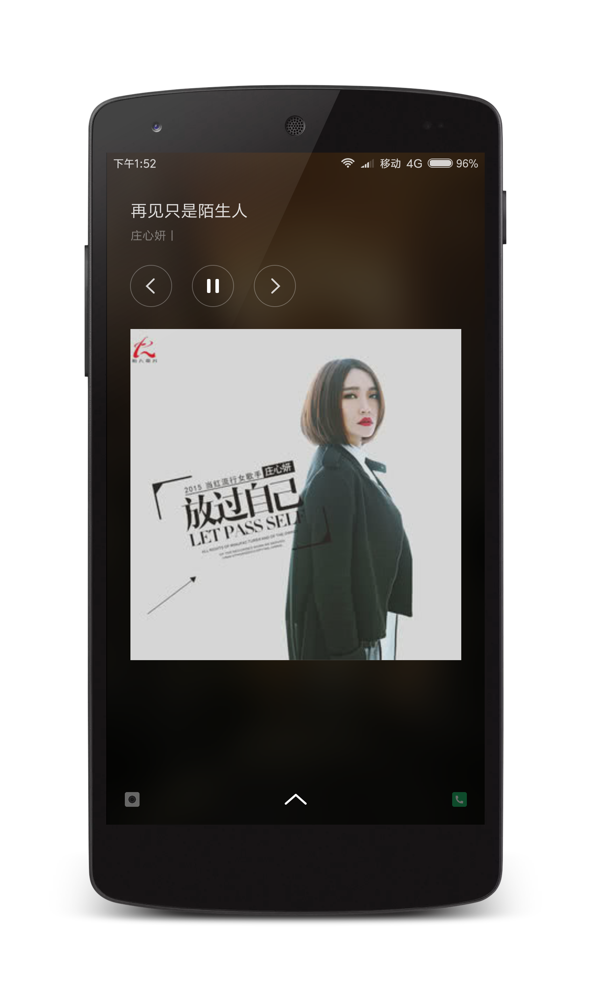

# MusicLib
一个比较简单的音乐播放封装库。

#### 为什么要做这样的一个库：  
1. 刚好在工作中有做到音频播放的业务
2. 浏览了GitHub上很多很优秀的音乐播放器代码，但是没有找到类似可以将音频播放封装起来的库，所以有了这想法。（也许是因为业务不一样的原因，但是如果把基本的功能写在一个库里面，也是挺好的。）

#### 为什么没用到IPC机制去实现：  
大家都知道音乐播放一般都会用到IPC去实现，其实一开始是有用的，但是毕竟多进程的话有很多问题并不那么简单，一开始写demo的时候看上去用得很完美，但是用到实际项目中的时候各种业务就复杂了，所以就出现了很多问题，其中最多的就是会自动断开与服务端的链接，和在实现监听器的时候偶尔会报异常。
想到IPC的作用主要有两个：第一是数据共享，第二是获取更多的内存大小。而且加上随着android版本的升高，保活基本很难实现了，所以想想还是不用IPC了。
关于IPC的相关知识，当然是推荐刚哥的《Android开发艺术探索》。

#### 关于 Demo：  
demo中的音乐来自易源接口，不知道为什么，易源的接口就是慢，当你点击播放的时候可能要等一会，不过应该是能播的，你也可以换成你自己的音乐链接来做测试。

#### apk下载链接：
<a href="musicLibDemo.apk">musicLibDemo.apk</a>

#### Demo 截图：  
<a href="art/image1.png"></a>
<a href="art/image2.png"></a>

#### 引用：
```
allprojects {
    repositories {
        ...
        maven { url 'https://jitpack.io' }
    }
}

dependencies {
     compile 'com.github.lizixian18:MusicLib:v1.1'
}
```

[](https://jitpack.io/#lizixian18/MusicLib)

#### 用法：

整个库的功能是通过 MusicManager 这个类去获取和控制的。 
1. 首先在 Application 中进行初始化 ：
``` java
public class MusicApplication extends Application {
    @Override
    public void onCreate() {
        super.onCreate();
        MusicManager.get().init(this);
    }
}
```

2. 然后进行服务的绑定和解绑定
``` java
MusicManager.get().bindToService(this,new ServiceConnectionCallback());
MusicManager.get().unbindService(this);
```
如果绑定的时候不想要回调，可以调用一个参数的 bindToService 。之后就可以使用了。  
使用之前记得先设置播放列表：
``` java
private List<MusicInfo> musicInfos = new ArrayList<>();
//...省略一堆操作
MusicManager.get().setMusicList(musicInfos);
```

#### Api

``` java
1.  bindToService(Context context, ServiceConnectionCallback connectionCallback) 绑定服务  
2.  unbindService(Context context)                                               解绑服务
3.  addOnPlayerEventListener(OnPlayerEventListener onPlayerEventListener)        添加音乐播放监听
4.  removePlayerEventListener(OnPlayerEventListener onPlayerEventListener)       移除音乐播放监听
5.  clearPlayerEventListener()       清除所以音乐播放监听
6.  getMusicList()                   得到当前播放列表
7.  setMusicList()                   设置当前播放列表
8.  playPause()                      播放或者暂停
9.  startPlay()                      开始播放
10. pausePlay()                      暂停播放
11. stopPlay()                       停止播放
12. playPrev()                       播放上一首
13. seekTo(int msec)                 转跳到某个时间
14. isPlaying()                      判断是否在播放
15. isPausing()                      判断是否暂停
16. isPreparing()                    判断是否在准备中
17. isIdle()                         判断是否空闲
18. playByPosition(int position)     根据在音乐列表中的位置播放
19. playByMusicInfo(MusicInfo music) 根据音乐信息播放
20. getPlayingPosition()             获取正在播放的歌曲在播放列表中的位置
21. setPlayingPosition(int position) 设置播放列表中的位置
22. playNext()                       播放下一首
23. hasPrev()                        判断是否有上一首歌
24. hasNext()                        判断是否有下一首歌
25. getCurrentPosition()             获取当前的进度
26. getPlayingMusic()                获取当前正在播放的音乐信息
27. quit()                           退出
28. getPlayMode()                    得到当前的播放模式
29. setPlayMode()                    设置当前播放模式
30. setQuitTimer(long milli)         设置音乐定时停止的时间（单位：秒）
31. addObservable(Observer o)        添加音乐监听观察者
```

#### 变量说明
播放模式一共有4种，定义在PlayMode里面：
```java
PlayMode.PLAY_IN_ORDER       顺序播放
PlayMode.PLAY_IN_SINGLE_LOOP 单曲循环
PlayMode.PLAY_IN_RANDOM      随机播放
PlayMode.PLAY_IN_LIST_LOOP   列表循环
```
默认是顺序播放。

播放状态有4种，定义在MusicPlayService里面
```java
MusicPlayService.STATE_IDLE      空闲状态
MusicPlayService.STATE_PREPARING 准备状态
MusicPlayService.STATE_PLAYING   正在播放
MusicPlayService.STATE_PAUSE     暂停
```

#### 关于音乐实体类 MusicInfo
MusicInfo是我定义的一个音乐实体类，里面的字段基本能够应付大多数的情况了，如果跟你的觉得不合适的话，可以替换成自己的。

#### 其他功能
有些时候我只想监听音乐的播放和停止，比如在一个列表中监听这两种情况去改变一下UI（比如播放暂停按钮的状态），
因为设置监听器有些麻烦，而且方法很多，所以除了设置监听器来监听音乐的播放情况外，还提供了一种监听方法，用法如下：  
这种方法是利用了观察者模式去实现的。
```java
//比如在一个adapter中，监听列表播放暂停按钮的状态
//首先让adapter继承Observer接口,并实现update方法
public class MusicAdapter extends RecyclerView.Adapter<MusicAdapter.MusicHolder> implements Observer {
    
    @Override
    public void update(Observable observable, Object o) {
         
    }
}

//然后调用添加音乐监听观察者方法即可
MusicAdapter musicAdapter = new MusicAdapter(this);
recyclerView.setAdapter(musicAdapter);
MusicManager.get().addObservable(musicAdapter);

//当音乐暂停或者开始的时候，update方法就会调用，Object参数的值是播放状态，
//分别是 MusicPlayService.STATE_PLAYING 和 MusicPlayService.STATE_PAUSE
//这时候就可以根据这个状态去判断做自己的逻辑了。

```

关于通知栏，因为考虑到通知栏这种要设置点击打开的界面，所以还是留给自己去实现吧。  
总体来说，整个Lib的封装代码还是非常简单的，有兴趣可以看看，希望你喜欢。  
欢迎 Star 和 Fork，以及提出你宝贵的意见。

#### About me
An android developer in GuangZhou  
简书：[http://www.jianshu.com/users/286f9ad9c417/latest_articles](http://www.jianshu.com/users/286f9ad9c417/latest_articles)   
Email:386707112@qq.com  
If you want to make friends with me, You can give me a Email and follow me。

#### License
```
Copyright 2018 L_Xian   
 
Licensed under the Apache License, Version 2.0 (the "License");  
you may not use this file except in compliance with the License.  
You may obtain a copy of the License at  

http://www.apache.org/licenses/LICENSE-2.0  

Unless required by applicable law or agreed to in writing, software  
distributed under the License is distributed on an "AS IS" BASIS,  
WITHOUT WARRANTIES OR CONDITIONS OF ANY KIND, either express or implied.  
See the License for the specific language governing permissions and  
limitations under the License.
```
