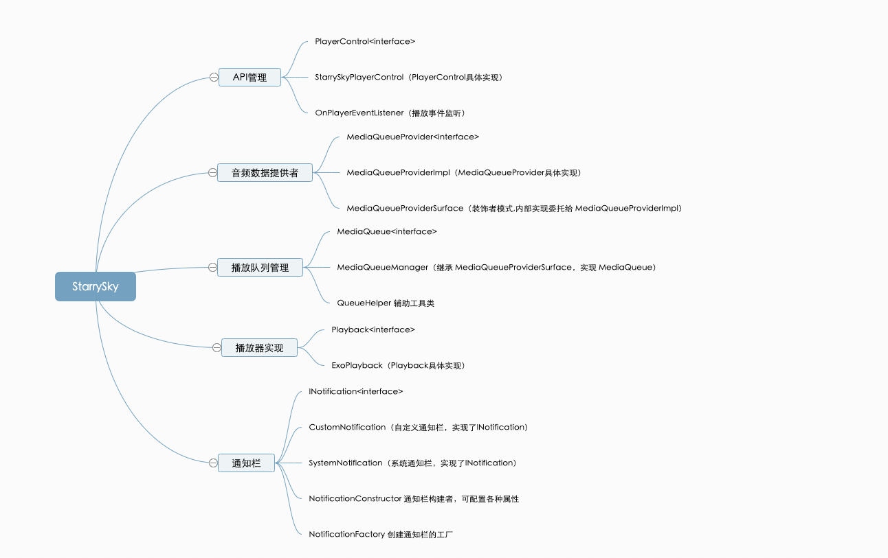

# StarrySky 介绍

StarrySky 是一个音频集成库，鉴于在一些项目中如果需要集成音频播放功能的话，都离不开对播放器的封装，对播放控制的封装，对 API 的
封装等操作，其实这些操作在不同项目中都是大同小异的，所以 StarrySky 就是这样一个集成了播放音频所需的操作的一个库。

StarrySky 主打集成简单，代码小巧简单易读懂，使用方便等方向，如果你的项目需要一些很特殊的功能或者有其他要求，本项目应该不适合你。

StarrySky 总体来说可以分为几个模块：
1. API 控制
2. 音频数据提供者
3. 播放队列管理
4. 播放器实现
5. 通知栏

## StarrySky 结构图
